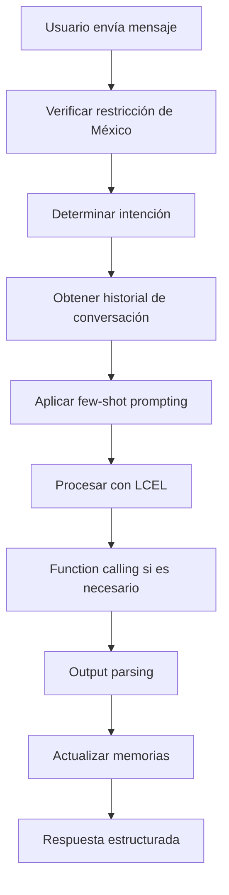

# Análisis Detallado de la Integración de LangChain en MX32 Backend

## 📋 Resumen Ejecutivo

El proyecto `mx32-backend` ha implementado exitosamente una integración completa de LangChain con características avanzadas que incluyen:

- **LangChain Expression Language (LCEL)**
- **Output Parsers estructurados**
- **Few-Shot Prompting**
- **Conversation Entity Memory**
- **Function Calling**
- **Restricciones de datos específicas de México**

## 🏗️ Arquitectura de la Integración

### 1. **Estructura de Archivos**

```
mx32-backend/app/
├── services/
│   ├── chatbot_agent.py              # Agente básico
│   └── advanced_chatbot_agent.py     # Agente avanzado con LangChain
├── models/
│   ├── chatbot.py                    # Modelos básicos
│   └── output_parsers.py             # Output parsers de LangChain
├── prompts/
│   └── few_shot_templates.py         # Templates de few-shot prompting
├── tools/
│   └── mx32_tools.py                 # Herramientas para function calling
└── api/
    └── chatbot.py                    # Endpoints del chatbot
```

### 2. **Dependencias LangChain**

```python
# requirements.txt
langchain==0.3.7
langchain-openai==0.2.8
langchain-core==0.3.15
langchain-community==0.3.7
```

## 🔧 Características Implementadas

### **1. LangChain Expression Language (LCEL)**

**Ubicación**: `app/services/advanced_chatbot_agent.py`

```python
def _create_chat_chain(self):
    """Crea la cadena LCEL para chat general"""
    return (
        {
            "input": RunnablePassthrough(),
            "current_page": RunnableLambda(lambda x: x.get("current_page", "N/A")),
            "current_state": RunnableLambda(lambda x: x.get("current_state", "N/A")),
            "current_parameter": RunnableLambda(lambda x: x.get("current_parameter", "N/A")),
            "tool_names": RunnableLambda(lambda x: ", ".join([tool.name for tool in self.tools])),
            "chat_history": RunnableLambda(lambda x: self._get_chat_history(x.get("session_id", "default"))),
            "agent_scratchpad": RunnableLambda(lambda x: [])
        }
        | chat_template
        | self.llm_with_tools
        | StrOutputParser()
    )
```

**Beneficios**:
- Código más limpio y composable
- Fácil mantenimiento y extensión
- Separación clara de responsabilidades

### **2. Output Parsers**

**Ubicación**: `app/models/output_parsers.py`

```python
class StructuredAnalysisResponse(BaseModel):
    """Respuesta estructurada para análisis de datos"""
    analysis: str = Field(description="Análisis principal del estado/parámetro")
    insights: List[str] = Field(description="Insights clave identificados", min_items=1, max_items=5)
    recommendations: List[str] = Field(description="Recomendaciones específicas", min_items=1, max_items=5)
    key_metrics: Dict[str, Any] = Field(description="Métricas clave extraídas")
    confidence: ConfidenceLevel = Field(description="Nivel de confianza del análisis")
    analysis_type: AnalysisType = Field(description="Tipo de análisis realizado")
    state_context: Optional[str] = Field(description="Contexto específico del estado")
    timestamp: datetime = Field(default_factory=datetime.now)
```

**Modelos Implementados**:
- `StructuredAnalysisResponse`: Análisis estructurado
- `ComparisonResponse`: Comparaciones entre estados
- `TrendAnalysisResponse`: Análisis de tendencias
- `EntityExtractionResponse`: Extracción de entidades
- `FunctionCallResponse`: Respuestas de function calling
- `ChatResponseStructured`: Respuesta completa del chat

### **3. Few-Shot Prompting**

**Ubicación**: `app/prompts/few_shot_templates.py`

```python
class FewShotTemplates:
    def get_security_template(self) -> FewShotPromptTemplate:
        """Template para análisis de seguridad"""
        return FewShotPromptTemplate(
            examples=self.examples["security_analysis"],
            example_prompt=example_prompt,
            prefix="""Eres un experto en análisis de seguridad pública en México...""",
            suffix="""Pregunta: {input}\n\nRespuesta:""",
            input_variables=["input"]
        )
```

**Templates Disponibles**:
- Análisis de seguridad
- Análisis económico
- Análisis de infraestructura
- Consultas generales

### **4. Conversation Entity Memory**

**Ubicación**: `app/services/advanced_chatbot_agent.py`

```python
def _get_entity_memory(self, session_id: str) -> ConversationEntityMemory:
    """Obtiene o crea la memoria de entidades"""
    if session_id not in self.entity_memory:
        self.entity_memory[session_id] = ConversationEntityMemory(
            llm=self.llm,
            memory_key="entity_memory",
            return_messages=True
        )
    return self.entity_memory[session_id]
```

**Funcionalidades**:
- Memoria semántica de entidades específicas
- Persistencia por sesión
- Extracción automática de entidades relevantes

### **5. Function Calling**

**Ubicación**: `app/tools/mx32_tools.py`

```python
@tool
def get_state_data(state: str, parameter: str) -> Dict[str, Any]:
    """Obtiene datos específicos de un estado y parámetro"""
    # Implementación de la herramienta
    pass

@tool
def compare_states(states: List[str], parameter: str) -> Dict[str, Any]:
    """Compara múltiples estados en un parámetro específico"""
    # Implementación de la herramienta
    pass
```

**Herramientas Implementadas**:
- `get_state_data()`: Obtener datos de estado
- `compare_states()`: Comparar estados
- `get_trend_analysis()`: Análisis de tendencias
- `get_recommendations()`: Generar recomendaciones
- `search_similar_states()`: Buscar estados similares
- `get_historical_data()`: Datos históricos

## 🚀 Endpoints Implementados

### **Backend (FastAPI)**

```python
@router.post("/chat-advanced", response_model=ChatResponseStructured)
async def chat_with_advanced_agent(request: ChatRequest):
    """Endpoint para chat con el agente avanzado (LCEL, Output Parsers, etc.)"""

@router.post("/deepchat-advanced")
async def deepchat_advanced_endpoint(request: DeepChatRequest):
    """Endpoint avanzado para Deep Chat con todas las características de LangChain"""
```

### **Endpoints Disponibles**:
- `POST /api/chatbot/chat-advanced`: Chat con agente avanzado
- `POST /api/chatbot/deepchat-advanced`: Deep Chat avanzado
- `GET /api/chatbot/conversation/{session_id}`: Obtener historial
- `DELETE /api/chatbot/conversation/{session_id}`: Limpiar historial

## 🔄 Flujo de Procesamiento



## 🛡️ Características Especiales

### **Restricción de Datos de México**

```python
def _check_mexico_restriction(self, message: str) -> tuple[bool, str]:
    """Verifica si la pregunta es sobre datos de México o externos"""
    # Palabras clave que indican países o regiones externas
    external_countries = [
        "estados unidos", "usa", "eeuu", "united states", "america",
        "canada", "canadá", "brasil", "argentina", "colombia", "chile",
        # ... más países
    ]
    
    # Verificar si menciona países externos
    for country in external_countries:
        if country in message_lower:
            return False, "Lo siento, pero solo puedo proporcionar información sobre datos de México..."
    
    return True, ""
```

### **Gestión Mejorada de Historial**

```python
async def _handle_history_question(self, context: Dict, api_data: Optional[Dict]) -> ChatResponseStructured:
    """Maneja específicamente preguntas sobre historial de conversación"""
    # Extraer preguntas anteriores del historial
    previous_questions = []
    for msg in chat_history[-8:]:  # Últimas 8 interacciones
        # Procesar mensajes del usuario
        if is_user_message:
            question_text = msg.content.strip()
            if question_text and question_text not in previous_questions:
                previous_questions.append(question_text)
```

## 📊 Estructura de Respuesta

```json
{
  "response": "Respuesta principal del asistente",
  "structured_data": {
    "analysis": "Análisis estructurado",
    "insights": ["Insight 1", "Insight 2"],
    "recommendations": ["Recomendación 1", "Recomendación 2"],
    "confidence": "high",
    "analysis_type": "seguridad"
  },
  "suggested_actions": ["Acción 1", "Acción 2"],
  "follow_up_questions": ["Pregunta 1", "Pregunta 2"],
  "confidence": 0.9,
  "sources": ["Base de datos MX32"],
  "model_used": "gpt-4o-mini",
  "session_id": "session_123",
  "memory_used": true,
  "entity_data": {
    "states_mentioned": ["Jalisco"],
    "entities": {"general": ["seguridad"]},
    "intent": "general_analysis"
  }
}
```

## 🧪 Testing

### **Archivos de Prueba**:
- `test_advanced_chatbot.py`: Pruebas del agente avanzado
- `test_history_functionality.py`: Pruebas de funcionalidad de historial

### **Casos de Prueba Incluidos**:
1. Análisis de seguridad con few-shot prompting
2. Prueba de historial de conversación
3. Prueba de restricción de México
4. Comparación de estados
5. Generación de recomendaciones
6. Búsqueda de estados similares

## 🎯 Beneficios Obtenidos

### **Para el Usuario**:
- Respuestas más precisas y contextuales
- Memoria de conversación persistente
- Restricción clara a datos de México
- Acciones sugeridas relevantes
- Preguntas de seguimiento inteligentes

### **Para el Desarrollador**:
- Código más limpio y mantenible
- Arquitectura escalable
- Fácil adición de nuevas funcionalidades
- Separación clara de responsabilidades
- Testing automatizado

### **Para el Negocio**:
- Mejor experiencia de usuario
- Respuestas más profesionales
- Cumplimiento de restricciones de datos
- Escalabilidad para futuras funcionalidades
- Mantenimiento reducido

## 📝 Notas Técnicas

- **Dependencias**: `langchain-core==0.3.15`, `langchain-community==0.3.7`
- **Memoria**: `ConversationBufferWindowMemory` + `ConversationEntityMemory`
- **Templates**: Few-shot prompting con ejemplos contextuales
- **Tools**: 6 herramientas especializadas para MX32
- **Parsers**: 5 output parsers para diferentes tipos de respuesta

---

**Estado**: ✅ **IMPLEMENTACIÓN COMPLETA**  
**Fecha**: Diciembre 2024  
**Versión**: 1.0.0

