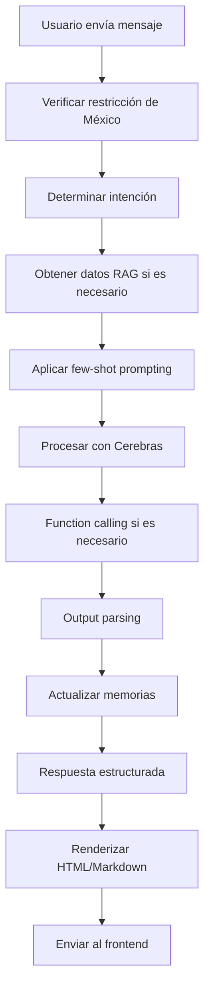

# MX32 RAG + LangChain + Cerebras Integration

## 🚀 Descripción

Sistema integrado que combina **RAG (Retrieval-Augmented Generation)**, **LangChain** y **Cerebras AI** para análisis avanzado de estados mexicanos con capacidades de Deep Chat.

## ✨ Características

### **RAG (Retrieval-Augmented Generation)**
- ✅ Acceso a datos reales de Firebase
- ✅ Análisis contextual de estados mexicanos
- ✅ Respuestas basadas en datos actualizados

### **LangChain Avanzado**
- ✅ **LangChain Expression Language (LCEL)**: Cadenas de procesamiento elegantes
- ✅ **Output Parsers**: Respuestas estructuradas y consistentes
- ✅ **Few-Shot Prompting**: Mejores respuestas contextuales
- ✅ **Function Calling**: Herramientas especializadas
- ✅ **Conversation Memory**: Memoria de conversación persistente

### **Cerebras AI**
- ✅ Motor de inferencia de alta calidad
- ✅ Modelo: `gpt-oss-120b`
- ✅ Streaming de respuestas
- ✅ Razonamiento avanzado

### **Deep Chat Frontend**
- ✅ Compatible con `mx32-frontend`
- ✅ Renderizado HTML/Markdown
- ✅ Respuestas estructuradas
- ✅ Acciones sugeridas
- ✅ Preguntas de seguimiento

## 🏗️ Arquitectura

```
┌─────────────────┐    ┌──────────────────┐    ┌─────────────────┐
│   Frontend      │    │   Backend API    │    │   Cerebras AI   │
│   (Deep Chat)   │◄──►│   (FastAPI)      │◄──►│   (GPT-OSS-120B)│
│   mx32-frontend │    │   Port 8001      │    │                 │
└─────────────────┘    └──────────────────┘    └─────────────────┘
                                │
                                ▼
                       ┌──────────────────┐
                       │   Firebase       │
                       │   (Datos RAG)    │
                       └──────────────────┘
```

## 📁 Estructura del Proyecto

```
Backend_IA_mx32/
├── models/
│   ├── output_parsers.py      # Output parsers de LangChain
│   └── chatbot.py             # Modelos de chatbot
├── services/
│   ├── cerebras_client.py     # Cliente de Cerebras
│   └── rag_langchain_agent.py # Agente principal
├── prompts/
│   └── few_shot_templates.py  # Templates de few-shot
├── tools/
│   └── rag_tools.py           # Herramientas RAG
├── api/
│   └── deepchat_endpoints.py  # Endpoints para Deep Chat
├── rag_langchain_server.py    # Servidor principal
├── test_langchain_integration.py # Tests de integración
└── requirements_langchain.txt  # Dependencias
```

## 🚀 Instalación

### 1. Instalar Dependencias

```bash
pip install -r requirements_langchain.txt
```

### 2. Configurar Variables de Entorno

```bash
cp env_langchain_example.txt .env
# Editar .env con tus configuraciones
```

### 3. Configurar Cerebras

```python
# En .env
CEREBRAS_API_KEY=tu_api_key_de_cerebras
CEREBRAS_MODEL=gpt-oss-120b
```

### 4. Ejecutar Servidor

```bash
python rag_langchain_server.py
```

## 🔌 Endpoints Disponibles

### **Deep Chat**

#### `POST /api/deepchat/chat`
Endpoint principal para Deep Chat con RAG y LangChain.

**Request:**
```json
{
  "messages": [
    {
      "role": "user",
      "text": "¿Cuáles son las oportunidades de inversión en Jalisco?"
    }
  ],
  "user_id": "user123",
  "context": {
    "current_state": "jalisco",
    "current_parameter": "Oportunidades Emergentes"
  },
  "use_rag": true
}
```

**Response:**
```json
{
  "html": "<h3>Análisis de Oportunidades en Jalisco</h3>...",
  "structured_data": {...},
  "rag_data": {...},
  "suggested_actions": [...],
  "follow_up_questions": [...],
  "confidence": 0.9,
  "sources": ["Base de datos MX32", "RAG Analysis"],
  "model_used": "cerebras-gpt-oss-120b",
  "rag_enabled": true,
  "session_id": "deepchat_123"
}
```

#### `POST /api/deepchat/chat-advanced`
Endpoint avanzado con todas las características de LangChain.

#### `GET /api/deepchat/health`
Health check del sistema.

### **RAG (Existente)**

#### `POST /api/rag/consulta-estado`
Consulta RAG de un estado específico.

#### `POST /api/rag/consulta-ia-estado`
Consulta de IA sobre un estado.

## 🧪 Testing

### Ejecutar Tests de Integración

```bash
python test_langchain_integration.py
```

### Tests Incluidos

1. **Integración RAG + LangChain**
   - Chat con RAG habilitado
   - Chat sin RAG
   - Verificación de restricción de México
   - Análisis de entidades
   - Acciones sugeridas
   - Preguntas de seguimiento

2. **Endpoints Deep Chat**
   - Funcionamiento de endpoints
   - Generación de HTML/Markdown
   - Respuestas estructuradas

## 🔧 Configuración Avanzada

### **Few-Shot Prompting**

Los templates están en `prompts/few_shot_templates.py`:

- **RAG Analysis**: Para consultas con datos RAG
- **Security Analysis**: Para análisis de seguridad
- **Economic Analysis**: Para análisis económico
- **Infrastructure Analysis**: Para análisis de infraestructura
- **General Consultation**: Para consultas generales

### **Output Parsers**

Modelos estructurados en `models/output_parsers.py`:

- `RAGAnalysisResponse`: Respuestas específicas de RAG
- `StructuredAnalysisResponse`: Análisis estructurado
- `ComparisonResponse`: Comparaciones entre estados
- `TrendAnalysisResponse`: Análisis de tendencias
- `EntityExtractionResponse`: Extracción de entidades

### **Function Calling**

Herramientas RAG en `tools/rag_tools.py`:

- `get_estado_rag_data()`: Obtener datos de estado
- `consulta_ia_estado()`: Consulta de IA
- `obtener_resumen_estado()`: Resumen ejecutivo
- `comparar_estados_rag()`: Comparar estados
- `buscar_estados_similares()`: Estados similares
- `generar_recomendaciones_rag()`: Recomendaciones

## 🌐 Integración con Frontend

### **Configuración del Frontend**

En `mx32-frontend`, actualizar la URL del API:

```typescript
// En tu archivo de configuración
const API_BASE_URL = 'http://localhost:8001/api/deepchat';
```

### **Uso en Deep Chat**

```typescript
// Ejemplo de uso en el frontend
const response = await fetch('/api/deepchat/chat', {
  method: 'POST',
  headers: {
    'Content-Type': 'application/json',
  },
  body: JSON.stringify({
    messages: [
      {
        role: 'user',
        text: '¿Cuál es la situación de seguridad en Jalisco?'
      }
    ],
    user_id: 'user123',
    context: {
      current_state: 'jalisco',
      current_parameter: 'Situación de Seguridad'
    },
    use_rag: true
  })
});

const data = await response.json();

// Renderizar respuesta
if (data.html) {
  // Usar HTML renderizado
  element.innerHTML = data.html;
} else if (data.text) {
  // Usar texto simple
  element.textContent = data.text;
}

// Mostrar acciones sugeridas
if (data.suggested_actions) {
  data.suggested_actions.forEach(action => {
    // Crear botones de acción
  });
}
```

## 📊 Flujo de Procesamiento



## 🎯 Características Especiales

### **Restricción de Datos de México**

El sistema solo responde sobre los 32 estados de México. Si el usuario pregunta sobre otros países, recibe una respuesta educativa redirigiendo a datos mexicanos.

### **Memoria de Conversación**

- **ConversationBufferWindowMemory**: Mantiene los últimos 10 intercambios
- **ConversationEntityMemory**: Memoria semántica de entidades específicas

### **Renderizado Inteligente**

- **Markdown a HTML**: Conversión automática de tablas, listas, títulos
- **Respuestas Estructuradas**: Datos organizados para el frontend
- **Acciones Sugeridas**: Botones de acción contextuales

## 🚨 Solución de Problemas

### **Error de Cerebras**

```bash
# Verificar API key
echo $CEREBRAS_API_KEY

# Verificar conectividad
curl -H "Authorization: Bearer $CEREBRAS_API_KEY" \
     https://api.cerebras.ai/v1/models
```

### **Error de Firebase**

```bash
# Verificar credenciales
python -c "import firebase_admin; print('Firebase OK')"

# Verificar archivo de credenciales
ls -la serviceAccountKey.json
```

### **Error de LangChain**

```bash
# Verificar dependencias
pip list | grep langchain

# Reinstalar si es necesario
pip install -r requirements_langchain.txt
```

## 📈 Métricas y Monitoreo

### **Health Check**

```bash
curl http://localhost:8001/api/deepchat/health
```

### **Logs**

Los logs se guardan en `rag_langchain.log` con información detallada de:
- Consultas de usuarios
- Respuestas generadas
- Uso de RAG
- Errores y excepciones

## 🔄 Próximos Pasos

1. **Optimización de Performance**
   - Cache de respuestas frecuentes
   - Optimización de consultas RAG

2. **Nuevas Funcionalidades**
   - Análisis de tendencias temporales
   - Comparaciones avanzadas entre estados
   - Exportación de reportes

3. **Integración Avanzada**
   - Webhooks para notificaciones
   - API de administración
   - Dashboard de métricas

---

**Estado**: ✅ **IMPLEMENTACIÓN COMPLETA**  
**Versión**: 2.0.0  
**Fecha**: Diciembre 2024  
**Compatible con**: mx32-frontend Deep Chat

