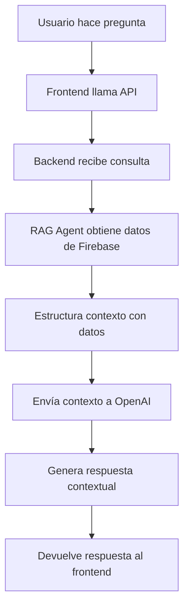

# Sistema RAG (Retrieval-Augmented Generation) para MX32

Este sistema integra capacidades de Inteligencia Artificial con los datos de Firebase para proporcionar respuestas contextuales sobre estados mexicanos.

## 🚀 Características

- **Integración con Firebase**: Acceso directo a datos de estados, parámetros y APIs
- **Respuestas Contextuales**: IA que responde basándose en datos reales del estado
- **Compatibilidad**: Se integra con el backend existente sin romper funcionalidad
- **Escalable**: Arquitectura modular que permite fácil extensión
- **API REST**: Endpoints claros y documentados

## 📁 Estructura del Proyecto

```
Backend_IA_mx32/
├── rag_agent.py              # Agente RAG principal
├── rag_service.py            # Servicio de integración
├── rag_endpoints.py          # Endpoints FastAPI
├── rag_server.py             # Servidor independiente
├── integrate_rag_backend.py  # Script de integración
├── requirements_rag.txt      # Dependencias
├── env_rag_example.txt       # Variables de entorno
└── README_RAG.md            # Este archivo
```

## 🔧 Instalación

### 1. Instalar Dependencias

```bash
pip install -r requirements_rag.txt
```

### 2. Configurar Variables de Entorno

```bash
# Copiar archivo de ejemplo
cp env_rag_example.txt .env

# Editar .env y configurar:
OPENAI_API_KEY=sk-your-openai-api-key-here
FIREBASE_PROJECT_ID=mx32-76c52
```

### 3. Configurar Firebase

Asegúrate de tener las credenciales de Firebase configuradas:
- `serviceAccountKey.json` en el directorio del proyecto, o
- Credenciales de gcloud: `gcloud auth application-default login`

## 🚀 Uso

### Opción 1: Servidor Independiente

```bash
python rag_server.py
```

El servidor estará disponible en `http://localhost:8001`

### Opción 2: Integración con Backend Existente

```bash
python integrate_rag_backend.py
```

Esto integrará el RAG con el backend existente en `mx32-backend/`

## 📚 API Endpoints

### Endpoints Principales

#### `POST /api/rag/consulta-estado-rag`
Consulta un estado con capacidades RAG.

```json
{
  "estado": "jalisco",
  "parametros": ["Situación de Seguridad", "Geografía y Logística"],
  "pregunta": "¿Cuáles son las principales oportunidades de inversión?"
}
```

#### `POST /api/rag/consulta-ia`
Consulta específica de IA sobre un estado.

```json
{
  "estado": "jalisco",
  "pregunta": "¿Cómo está la situación de seguridad en este estado?"
}
```

#### `GET /api/rag/estados-rag`
Obtiene lista de estados con información RAG.

#### `GET /api/rag/estado/{estado}/resumen`
Obtiene resumen ejecutivo de un estado.

#### `GET /api/rag/health-rag`
Verifica el estado del sistema RAG.

### Endpoints de Compatibilidad

#### `POST /api/rag/consulta-dinamica-rag`
Versión RAG del endpoint `consulta-dinamica` existente.

## 🔄 Flujo de Datos



## 🧠 Cómo Funciona el RAG

1. **Retrieval (Recuperación)**:
   - Consulta Firebase para obtener datos del estado
   - Obtiene parámetros específicos solicitados
   - Recupera datos de APIs externas
   - Obtiene textos de análisis

2. **Augmentation (Aumento)**:
   - Estructura los datos en contexto coherente
   - Combina datos numéricos con análisis textual
   - Organiza información por parámetros

3. **Generation (Generación)**:
   - Envía contexto estructurado a OpenAI
   - Genera respuesta contextual y precisa
   - Mantiene coherencia con los datos reales

## 📊 Datos Utilizados

### Colecciones de Firebase
- **states**: Información de estados mexicanos
- **parameters**: Parámetros de análisis disponibles
- **apis**: URLs de APIs externas
- **special_text**: Textos de análisis específicos

### Parámetros de Análisis
1. Situación de Seguridad
2. Geografía y Logística
3. Oportunidades Emergentes
4. Mapa de Sectores Claves
5. Vocación Económica y Sectores Estratégicos
6. Situación Natural Ambiental
7. Perspectiva de Crecimiento
8. Infraestructura y Conectividad
9. Capital Humano

## 🔧 Configuración Avanzada

### Variables de Entorno

```bash
# OpenAI
OPENAI_API_KEY=sk-...
OPENAI_MODEL=gpt-4o-mini
OPENAI_MAX_TOKENS=1000
OPENAI_TEMPERATURE=0.7

# Firebase
FIREBASE_PROJECT_ID=mx32-76c52

# Servidor
RAG_HOST=0.0.0.0
RAG_PORT=8001
RAG_DEBUG=True

# Cache
CACHE_TTL=3600
ENABLE_CACHE=True
```

### Personalización del Prompt

El sistema usa prompts personalizables en `rag_agent.py`:

```python
prompt = f"""
Eres un asistente especializado en análisis económico y de inversión para estados mexicanos.
Tienes acceso a datos completos y actualizados sobre {estado_nombre}.

CONTEXTO DISPONIBLE:
{contexto}

PREGUNTA DEL USUARIO: {pregunta}
...
"""
```

## 🧪 Testing

### Prueba Básica

```bash
python rag_agent.py
```

### Prueba de Integración

```bash
python test_rag_integration.py
```

### Prueba de Endpoints

```bash
# Iniciar servidor
python rag_server.py

# En otra terminal, probar endpoints
curl -X POST "http://localhost:8001/api/rag/consulta-ia" \
  -H "Content-Type: application/json" \
  -d '{"estado": "jalisco", "pregunta": "¿Cuáles son las principales características?"}'
```

## 🚨 Solución de Problemas

### Error: "OpenAI no configurado"
- Verificar que `OPENAI_API_KEY` esté configurada
- Verificar que la API key sea válida

### Error: "Firebase no conectado"
- Verificar credenciales de Firebase
- Ejecutar `gcloud auth application-default login`
- Verificar que `serviceAccountKey.json` exista

### Error: "Estado no encontrado"
- Verificar que el nombre del estado esté en minúsculas
- Verificar que el estado exista en Firebase

### Respuestas de baja calidad
- Ajustar `OPENAI_TEMPERATURE` (0.1-1.0)
- Aumentar `OPENAI_MAX_TOKENS`
- Verificar que los datos de Firebase estén completos

## 🔮 Mejoras Futuras

- [ ] Cache inteligente de respuestas
- [ ] Integración con ChromaDB para búsqueda vectorial
- [ ] Análisis de sentimientos en respuestas
- [ ] Generación de reportes automáticos
- [ ] Integración con más fuentes de datos
- [ ] Dashboard de métricas de uso

## 📞 Soporte

Para problemas o preguntas:
1. Revisar logs en `rag_agent.log`
2. Verificar configuración de variables de entorno
3. Probar con `test_rag_integration.py`
4. Revisar estado de servicios con `/api/rag/health-rag`

## 📄 Licencia

Este proyecto es parte del sistema MX32 y sigue las mismas políticas de licencia.

